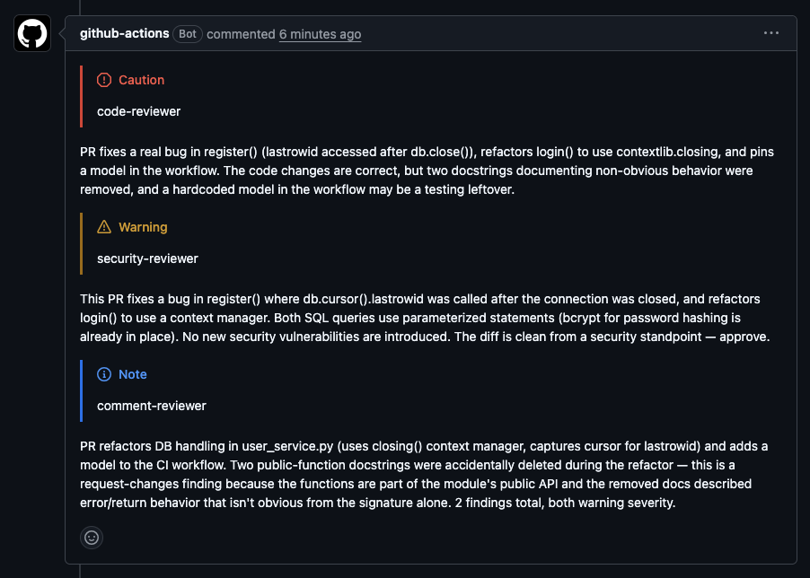
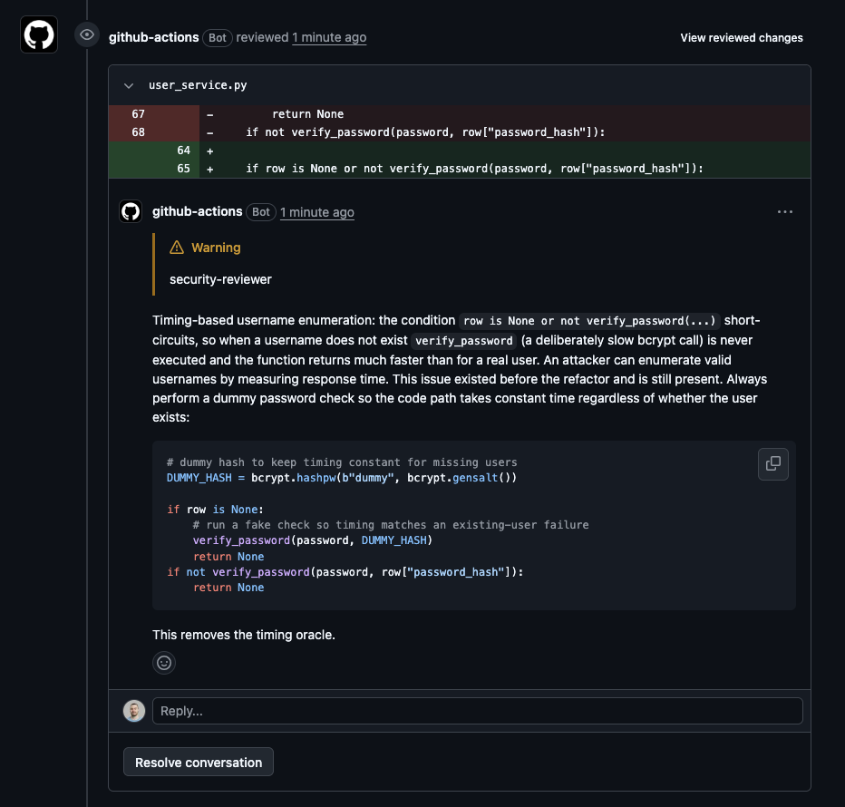
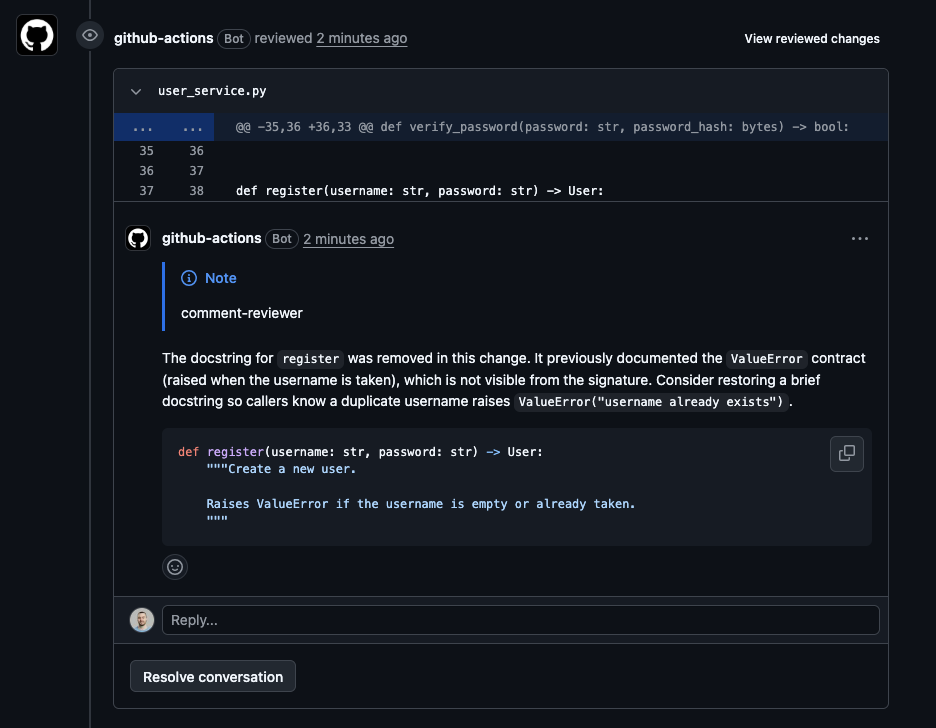
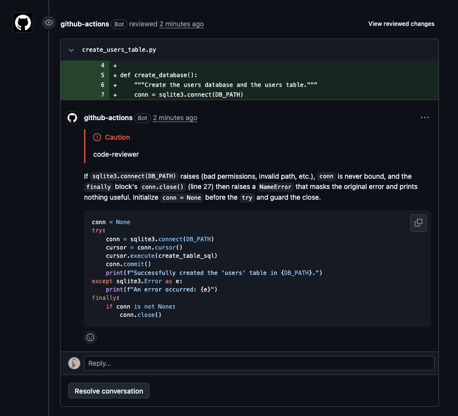
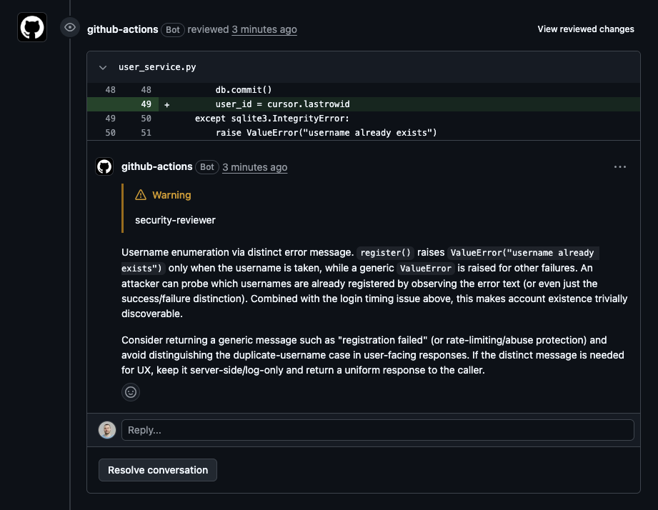

# Ante PR Review

A composite GitHub Action that runs the [ante](https://ante.run) headless CLI to review pull requests and posts:

- a **summary** as a top-level PR comment (deduped across re-pushes), and
- **line-anchored review comments** on specific files/lines via the GitHub REST API.



<details>
  <summary>Additional images/screenshots</summary>

  

  

  

  

</details>

## Why Ante?

There are a few things that make ante great for CI usage:

- Single binary that makes installation fast and simple
- [Ranks #1 on many different evals](https://antigma.ai/eval) and continually tested
- Sub-agents for parallel delegation of all tasks
- Supports many different providers and models
- Comes with security, code, and comment sub-agent reviewers
- Comments on lines (not just one summary) and collapses comments on the same line

## How it works

- Installs the `ante` CLI tool
- Asks 3 sub-agents to review the code
- Generates a JSON output for each review
- Calls `gh` for each comment in each review
- Collapses comments on the same line
- Tags comments with severity `/alerts`

## Usage

```yaml
# .github/workflows/ante-review.yml
name: Ante Review
on:
  pull_request:
    types: [opened, synchronize, reopened]
permissions:
  contents: read
  pull-requests: write
  issues: write
jobs:
  review:
    runs-on: ubuntu-latest
    # Skip fork PRs: GITHUB_TOKEN is read-only and secrets are unavailable on
    # forks, so the provider API key can't be accessed. See "Fork PRs" below.
    if: github.event.pull_request.head.repo.full_name == github.repository
    steps:
      - uses: actions/checkout@v4
        with:
          ref: ${{ github.event.pull_request.head.sha }}
      - uses: james2doyle/ante-ci-bot@main # or: `james2doyle/ante-ci-bot@v2` for tagged release
        with:
          provider: openrouter
          model: z-ai/glm-5.2 # consider models in the top evals
          effort: medium
          github-token: ${{ secrets.GITHUB_TOKEN }}
        env:
          OPENROUTER_API_KEY: ${{ secrets.OPENROUTER_API_KEY }}
```

## Inputs

| Input             | Required | Default          | Description                                                                 |
|-------------------|----------|------------------|-----------------------------------------------------------------------------|
| `provider`        | no       | `openrouter`     | ante provider: `anthropic`, `openai`, `gemini`, `xai`, `openrouter`, `openai-compatible` |
| `model`           | no       | `z-ai/glm-5.2`   | Model override. Empty = provider default.                                   |
| `effort`          | no       | `medium`         | `min` / `low` / `medium` / `high` / `xhigh` / `max`                         |
| `prompt`          | no       | (empty)          | Custom reviewer prompt appended to the delegation. Use to focus the review. |
| `max-diff-lines`  | no       | `4000`           | Truncates the diff beyond this many lines to avoid context overflow.        |
| `github-token`    | no       | `${{ github.token }}` | Token for `gh`.                                                           |

## Provider secrets

ante reads the provider API key from an environment variable. Set the matching secret in your repo and pass it via `env:` on the step. The action itself is provider-agnostic.

| Provider            | Environment variable              |
|---------------------|-----------------------------------|
| `anthropic`         | `ANTHROPIC_API_KEY`               |
| `openai`            | `OPENAI_API_KEY`                  |
| `gemini`            | `GEMINI_API_KEY` (or `VERTEX_GEMINI_API_KEY` for Vertex AI) |
| `xai`               | `XAI_API_KEY`                     |
| `openrouter`        | `OPENROUTER_API_KEY`              |
| `openai-compatible` | `OPENAI_COMPATIBLE_API_KEY`       |

Example with OpenAI:

```yaml
      - uses: ./.github/actions/ante-review
        with:
          provider: openai
          model: gpt-4o
        env:
          OPENAI_API_KEY: ${{ secrets.OPENAI_API_KEY }}
```

## How it works

1. `install-ante.sh` runs the official ante installer (idempotent; skips if `ante` is already on PATH).
2. `review.py` fetches the PR diff with `gh pr diff`, truncates it to `max-diff-lines` if needed, and sets `ANTE_HOME` to the action's bundled `ante/` directory so ante discovers the sub-agents, skills, and global `AGENTS.md` in place — no file copying.
3. ante runs headless with `--output-format minimal`. The main agent delegates to three sub-agents (`code-reviewer`, `security-reviewer`, `comment-reviewer`), each reading the diff and writing its own review JSON to a per-agent file under `$RUNNER_TEMP`. `review.py` merges those files via `scripts/review_core.py` into `$RUNNER_TEMP/ante_review.json` — the **sole source of truth** — prefixing each summary block and line-comment body with its source sub-agent's name (e.g. `**code-reviewer:** ...`) so PR readers can tell which agent produced each comment.
4. `review.py` posts the merged `summary` as a PR issue comment (`gh pr comment --edit-last --create-if-none` so re-pushes edit instead of spamming), then loops over `comments[]` and calls `scripts/post_comment.py` per comment (in-process import, no per-comment subprocess spawn).
5. `post_comment.py` posts each line-anchored review comment via `gh api -X POST repos/{owner}/{repo}/pulls/{n}/comments` (`gh pr comment` has no `--line/--path/--side/--commit` flags).

All temp files live under `RUNNER_TEMP` (job-specific, auto-cleaned). The runner is ephemeral and the action never commits or pushes. Headless mode implies yolo (all tools auto-approved for the main agent), but each sub-agent restricts its own tools to `Read`/`Grep`/`Glob`/`Write` via its frontmatter, and the prompt guard (write only to the assigned review JSON path) plus the ephemeral runner contain side effects to the job.

## Fork PRs

The workflow's `if: github.event.pull_request.head.repo.full_name == github.repository` guard skips fork PRs because:

- `GITHUB_TOKEN` is read-only on forks, so the bot can't post comments.
- Repo secrets (the provider API key) are unavailable on forks.

For external contributions you can switch the trigger to `pull_request_target`, which runs in the base repo context with write access and secrets. **This has a security trade-off**: `pull_request_target` runs workflow code from the base branch (not the PR head), but if you explicitly check out the PR head and run arbitrary code from it, you can be exposed to a malicious PR. This action only reads a diff file and never executes PR-controlled code, so `pull_request_target` is safe here — but if you add steps that run PR-sourced code, gate them carefully.

## Behavior notes

- **Non-blocking.** Any ante exit, missing review file, or API failure posts a warning comment and exits 0. The action never fails the job.
- **Comment dedup.** The summary is edited in place across re-pushes via `--edit-last --create-if-none`. Line review comments are not deduped in v1 and will accumulate on re-push; a future version may submit a grouped review via `POST .../pulls/n/reviews`.
- **Line anchoring.** The GitHub API returns 422 if `line` is not in the diff for `commit_id`. The sub-agent is instructed to comment only on diff lines using absolute line numbers from the checked-out PR head; `post_comment.py` validates the line is a positive integer and the loop skips any 422 (non-blocking).
- **Diff truncation.** When the diff exceeds `max-diff-lines`, it is truncated and a marker is appended so the model knows the picture is incomplete.
- **Python 3.12.** The action relies on Python 3.12 being preinstalled on `ubuntu-latest`. No `setup-python` step is needed. If you target `macos-latest`/`windows-latest` or a future image drops 3.12, add `setup-python@v5` to the workflow.

## Testing

Test scripts live in `tests/`. They are plain Python assert scripts — zero pip installs, runs on any Python 3.12 runner. Run the safe ones together (no credentials needed):

```bash
python3 tests/run_all.py          # lint + agents + merge
```

Or run individually:

### Lint and syntax checks

```bash
python3 tests/test_lint.py
```

Runs `ruff check scripts/ tests/`, `py_compile` on all `.py` files, and `json.load` on `ante/settings.json`.

### Agent file conventions

```bash
python3 tests/test_agents.py
```

Verifies every `ante/agents/*.md` file: frontmatter has `name`/`description`/`tools` with `Write` listed, required section headers present (`## What to flag`, `## What to skip`, `## Output`), diff-source paragraph present, no hardcoded `/tmp/ante_review` paths, and review path is delegation-provided.

### Merge logic

```bash
python3 tests/test_merge.py
```

Tests the merge from `review_core.py` in isolation using sample per-agent files. Covers six cases: all three agents produce reviews, only one produces a review (others missing — non-blocking), a clean PR (all comments empty), comments with invalid fields filtered out, schema violations (non-array comments, non-string summary), and field-name aliases (`file`/`filename` → `path`, `message`/`comment`/`text` → `body`, `line_number`/`lineno` → `line`).

### End-to-end local run

```bash
python3 tests/e2e.py
```

Runs `review.py` against a real PR. Requires `ante` on PATH, `gh` authenticated, and the env vars the action injects. The script checks for required vars and exits with guidance if any are missing:

```bash
export RUNNER_TEMP=/tmp
export PR_NUMBER=123
export REPO=owner/repo
export HEAD_SHA=$(git rev-parse HEAD)
export GITHUB_TOKEN=ghp_xxx
export INPUT_PROVIDER=anthropic
export INPUT_EFFORT=medium
export ANTHROPIC_API_KEY=sk-ant-xxx   # must match INPUT_PROVIDER
python3 tests/e2e.py
```

This fetches the real PR diff, runs ante headless, merges the per-agent reviews, and **posts comments to the PR** — point it at a test repo. Inspect `$RUNNER_TEMP/ante_review.json` and `$RUNNER_TEMP/ante.out` / `ante.err` for debugging.
